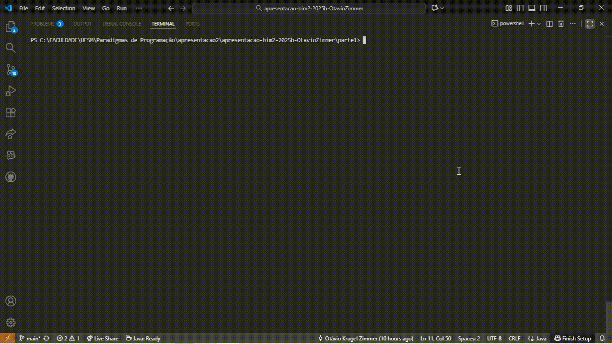

Esta prática concentrava-se no conceito de herança em Java, e foi dividida em 2 partes.

# Parte 1

Para a Parte 1 da prática, foi solicitado que fosse analisado e completado um código sobre organização de tarefas (assignments) de disciplinas de faculdade. O código era dividido em três arquivos: ``Assignment.java``, ``GroupAssignment.java`` e ``TrackAssignments.java``, respectivamente para representar uma tarefa, uma tarefa a ser desenvolvida em grupo e a classe que contém o método main, onde também é criada e manipulada uma lista de tarefas. 

Inicialmente, tínhamos que implementar o método ``public String toString()``, para formatar a saída do laço de exibição presente em ``TrackAssignments.java``.

A primeira versão:

<pre>
@Override
public String toString() {
  return "{ " + "dueDate=" + "'" + this.dueDate + "'" + ", description=" + "'" + this.description + "'" + ", pending=" + "'" + this.pending + "'" + ", submitDate=" + "'" + this.submitDate + "'" + "}";
}
</pre>

Identifiquei que era um jeito bem "manual". Resolvi pesquisar para ver se não encontrava algo para deixar mais "dinâmico", e encontrei o String.format, em Java. Então o código, com a aplicação deste método ficou assim:

<pre>
@Override
public String toString() {
  return String.format("{ dueDate='%s', description='%s', pending='%s', submitDate='%s'}",
          dueDate, description, pending, submitDate);
}
</pre>

``@Override`` é usado nesse caso para impedir que retorne o nome da classe + o hashcode do objeto. Por exemplo:

<pre>Assignment@5a07e868</pre>

Com a sua utilização, a saída fica corretamente em forma de string.

Depois, tínhamos que completar o método status, de modo que ele retornasse uma String representando o estado da tarefa: "done" se a tarefa estiver completa (não pendente); "late" se a tarefa estiver pendente e atrasada; "due in x days" se a tarefa estiver pendente, faltando x=daysLeft() dias para a entrega. Tudo levando em consideração as datas.
A lógica que utilizei foi uma estrutura condicional:

<pre>

private String status() {
  if (!isPending()) {
      return "done";
  }
  else if (daysLeft() < 0) {
      return "late";
  }
  else {
      return "due in " + daysLeft() + " days";
  }
}
</pre>

A princípio funcionou. Porém, obtive um problema, que percebi na hora dos testes: o método daysLeft estava implementado da seguinte forma:

<pre>
public int daysLeft() {
  return dueDate.compareTo(LocalDate.now());
}
</pre>

Este método, de acordo com sua documentação, neste caso retorna 0 se as datas forem iguais; > 0 se ``dueDate`` for depois de "hoje"; < 0 se for antes de hoje. Ou seja, ele não retornava o número de dias, mas sim o resultado da comparação de datas. Então, pesquisando sobre como poderia comparar especificamente datas sem que fosse necessário implementar algoritmos muito grandes, encontrei o chronoUnit, que foi essencial para deixar o método funcionando da maneira correta para a questão:

<pre>
public int daysLeft() {
  TemporalUnit unit = ChronoUnit.DAYS;
  return (int) LocalDate.now().until(dueDate, unit);
}
</pre>

Depois, foi necessário implementar o ``super`` no código, para que fosse possível chamar métodos da superclasse e acessar construtores da superclasse. No contexto da atividade, essa palavra chave foi usada para reaproveitar as mensagens implementadas normalmente na superclasse e adicionar variações para ela. Dessa forma, a depender do tipo da tarefa, pode ser enviada uma mensagem modificada quando a tarefa for em grupo.

<pre>
@Override
public String message() {
  if (!isPending()){
      return super.message();
  }
  return "Group " + super.message() + " - call " + this.teamMates;
}
</pre>

Por último, foi solicitado que fosse adicionado um código no final do main, para contar e mostrar a quantidade de tarefas concluídas (não pendentes):

<pre>
int completedAssignmentsCount = 0;
for (Assignment item : list) {
  if (!item.isPending()){
    completedAssignmentsCount += 1;
  }
}

System.out.println("\n==> Completed Assignments: " + completedAssignmentsCount);
</pre>

- Pontos fáceis: contar e mostrar a quantidade de tarefas concluídas e implementar o método ``toString``.

- Pontos difíceis: modificar o método ``daysLeft`` para se adequar ao que era pedido e entender o funcionamento do ``super`` e sua implementação no código.

## GIF de execução da Parte 1


# Parte 2

Para a parte 2, tínhamos que aplicar o conceito de herança para criar uma espécie de quizz, com hierarquia de classes e diferentes classes para cada parte.

Ao todo, criei 5 classes:
- ``Question``: classe base (superclasse) que representa uma questão genérica de quiz.
- ``TrueFalseQuestion``: subclasse de ``Question`` que representa uma questão de verdadeiro/falso.
- ``MultipleChoiceQuestion``: subclasse de ``Question`` que representa uma questão de múltipla escolha.
- ``Quiz``: classe que gerencia um conjunto de questões (``Question``).
- ``Main``: classe principal para demonstrar o funcionamento do programa.

Primeiro, tínhamos que criar uma classe ``Question``, com atributos/métodos comuns a qualquer tipo de quiz, os quais pudemos escolher. Alguns métodos, por exemplo:

<pre>
public Question(String texto) {
    this.texto = texto;
    this.respondida = false;
}

public String getTexto() {
    return texto;
}
</pre>

Nesse sentido, também iria precisar criar métodos mais "genéricos", porque teria de utilizá-los de diferentes maneiras dependendo do tipo de questão (no caso, escolhi questões de *TrueOrFalse* e *MultipleChoice*). Por exemplo:

<pre>
public String mostraQuestao() { // cada subclasse implementa (cada questão tem sua forma)
    return texto;
}

public boolean checarResposta(String resposta) { // cada subclasse implementa (cada questão tem sua forma)
    return false;
}
</pre>

Cada um destes métodos deve se adaptar para ser utilizado nas classes dos dois diferentes tipos de questões. É aí que entram as classes ``TrueFalseQuestion.java`` e ```MultipleChoiceQuestion.java``. Cada uma implementa seu respectivo tipo de questão, com base em ``Question``. Ou seja, são subclasses de ``Question``, contendo atributos específicos e implementações próprias de alguns métodos. No caso de ``TrueFalseQuestion.java``, por exemplo:

<pre>
public class TrueFalseQuestion extends Question {
  private boolean respostaCorreta;

  public TrueFalseQuestion(String texto, boolean respostaCorreta) {
      super(texto);
      this.respostaCorreta = respostaCorreta;
  }

  @Override
  public boolean checarResposta(String resposta) {
      marcarRespondida();
      boolean res = resposta.equalsIgnoreCase("true");
        return res == respostaCorreta;
    }

  @Override
  public String mostraQuestao() {
      return texto + " (True/False)\n";
  }
}
</pre>

É interessante destacar que fiz uma implementação própria dos métodos ``checarResposta`` e ``mostraQuestao`` para essa classe. Isso foi possível por meio do ``@Override``, em uma aplicação um pouco diferente do uso anterior da notação. No caso ele "substitui" a implementação do método em questão, de modo com que seja possível aplicar este método para um caso específico. Também utilizei o ``super``, onde nesse caso ``super(texto)`` chama o construtor da classe mãe (``Question``), inicializando o atributo texto e setando ``respondida = false``.

A implementação de ``MultipleChoiceQuestion.java`` é parecida, com a diferença de que também utilizei ``try`` e ``catch`` para lidar com o caso da resposta, que é uma "opção":

<pre>
import java.util.List;

public class MultipleChoiceQuestion extends Question {
  private List<String> opcoes;
  private int opcaoCorreta;

  public MultipleChoiceQuestion(String texto, List<String> opcoes, int opcaoCorreta) {
      super(texto);
      this.opcoes = opcoes;
      this.opcaoCorreta = opcaoCorreta;
  }

  @Override
  public boolean checarResposta(String resposta) {
      marcarRespondida();
      try {
          int escolha = Integer.parseInt(resposta);
          return escolha == opcaoCorreta;
      } catch (NumberFormatException e) {
          return false;
      }
  }

  @Override
  public String mostraQuestao() {
      String s = texto + "\n";
      for (int i = 0; i < opcoes.size(); i++) {
          s = s + i + ": " + opcoes.get(i) + "\n";
      }
      return s.toString();
  }
}
</pre>

No caso, ela também possui suas próprias implementações de ``checarResposta`` e ``mostraQuestao``, adaptadas para este tipo específico de questão. O ``super`` é aplicado do mesmo jeito que em ``TrueFalseQuestion.java``.

Após fazer isto, criei a classe ``Quiz``, que armazena e gerencia uma lista de questões:

<pre>
public class Quiz {
  private List<Question> questoes;

  public Quiz() {
      this.questoes = new ArrayList<>();
  }

  public void adicionarQuestao(Question q) {
      questoes.add(q);
  }

  public void mostrarTodasQuestoes() {
      for (Question q : questoes) {
          System.out.println(q.mostraQuestao());
      }
  }

  public void checarPergunta(int index, String resposta) {
      if (index >= 0 && index < questoes.size()) {
          boolean correta = questoes.get(index).checarResposta(resposta);
          System.out.println("Questão " + index + " respondida: " + (correta ? "Correta!" : "Incorreta!"));
      } else {
          System.out.println("Index inválido de questão.");
      }
  }

  public void questaoAleatoria() {
      Random aleatoria = new Random();
      int idx = aleatoria.nextInt(questoes.size());
      System.out.println("Questão aleatória:");
      System.out.println(questoes.get(idx).mostraQuestao());
  }
}
</pre>

Ela contém métodos, que lidam com a lista de questões. Também tem um método para escolher uma questão aleatória, com base nas questões existentes na lista. Para isso, utiliza a classe Random em Java.

Por último, criei a classe ``Main``, que cria um quiz com algumas questões de diferentes classes e faz 3 operações: 1) mostrar todas as questões; 2) checar resposta de uma questão; 3) sortear uma questão aleatória. A classe ``Main`` é implementada da seguinte forma:

<pre>
import java.util.Arrays;

public class Main {
  public static void main(String[] args) {
      Quiz quiz = new Quiz();

      quiz.adicionarQuestao(new TrueFalseQuestion("O Java é uma linguagem compilada?", true));
      quiz.adicionarQuestao(new MultipleChoiceQuestion("Qual é a capital da França?",
              Arrays.asList("Berlim", "Paris", "Roma", "Madri"), 1));
      quiz.adicionarQuestao(new TrueFalseQuestion("O Sol é uma estrela?", true));
      quiz.adicionarQuestao(new MultipleChoiceQuestion("Qual desses números é primo?",
              Arrays.asList("4", "6", "7", "8"), 2));

      // 1ª operação: mostrar todas as questões
      System.out.println("=== Todas as questões ===");
      quiz.mostrarTodasQuestoes();

      // 2ª operação: checar resposta de uma questão
      System.out.println("\n=== Checar resposta ===");
      quiz.checarPergunta(1, "1"); // correta
      quiz.checarPergunta(3, "0"); // incorreta

      // 3ª operação: sortear uma questão
      System.out.println("\n=== Questão aleatória ===");
      quiz.questaoAleatoria();
  }
}
</pre>

Com isso, pude concluir a parte 2.

- Pontos fáceis: criar as operações na classe ``Main`` e os métodos padrão em ``Question``

- Pontos difíceis: adaptar métodos para cada tipo de questão e checar a pergunta com base na resposta.

## GIF de execução da Parte 2


# Fontes
- toString(): http://www.mauda.com.br/?p=1472
- Override: https://stackoverflow.com/questions/94361/when-do-you-use-javas-override-annotation-and-why?
- String.format: https://www.w3schools.com/java/ref_string_format.asp
- compareTo(): https://www.w3schools.com/java/ref_string_compareto.asp
- chronoUnit: https://labex.io/tutorials/java-how-to-use-chronounit-for-date-operations-in-java-414155
- super: https://www.w3schools.com/java/ref_keyword_super.asp
- Random em Java: https://www.devmedia.com.br/numeros-aleatorios-em-java-a-classe-java-util-random/26355